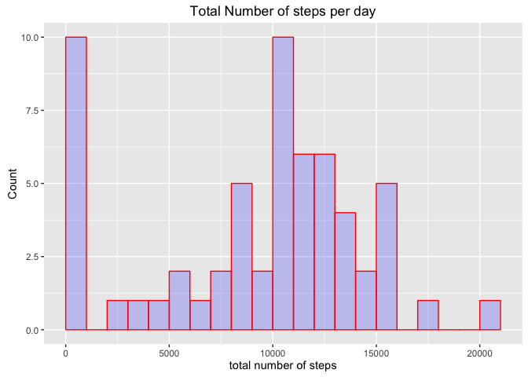
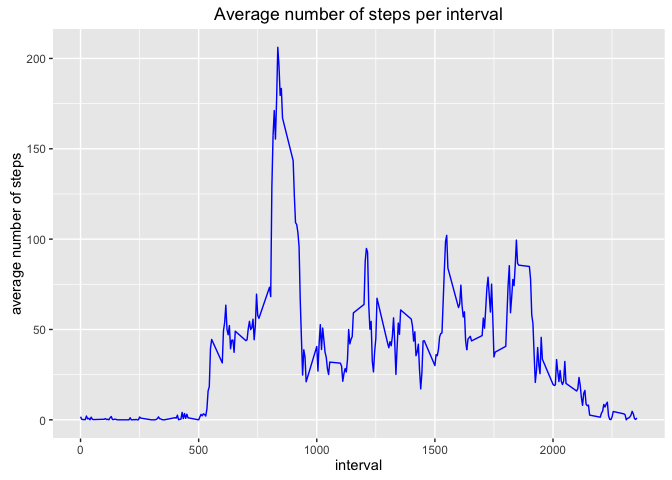
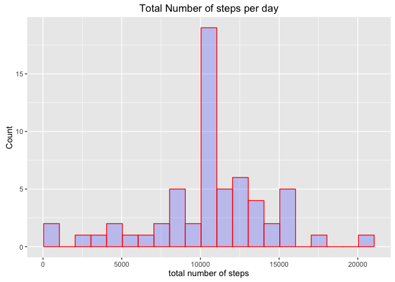
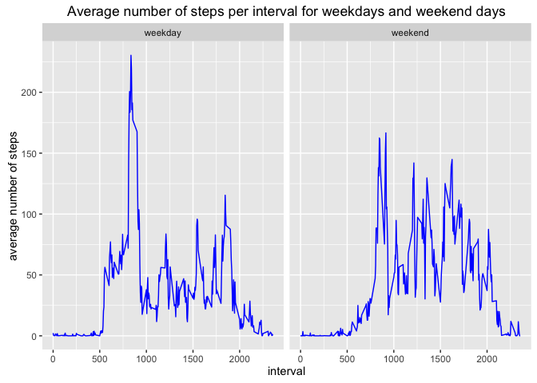

# Reproducible Research: Peer Assessment 1
Mirna van Hoek  
4 June 2017  

## Introduction

This assignment makes use of data from a personal activity monitoring
device. This device collects data at 5 minute intervals through out the
day. The data consists of two months of data from an anonymous
individual collected during the months of October and November, 2012
and include the number of steps taken in 5 minute intervals each day.

In this document answers the questions from Project 1 from the course 'Reproducable Research" from the Data Science specialisation.
It is written as a single R markdown document and then processed by knitr and transformed into an HTML file.

## Loading the packages that are needed


```r
library(dplyr)
```

```
## 
## Attaching package: 'dplyr'
```

```
## The following objects are masked from 'package:stats':
## 
##     filter, lag
```

```
## The following objects are masked from 'package:base':
## 
##     intersect, setdiff, setequal, union
```

```r
library(ggplot2)
library(knitr)
```

## Setting global options

Explicitly set echo to TRUE so R code will be visible and Set figure path, since default is not to save the figure to file

```r
knitr::opts_chunk$set(fig.path='figures/', echo=TRUE)
```

## Loading and preprocessing the data

The assumption is made that the data csv file has been placed in the working directory.
If it is not, you can download the 
[Activity monitoring data](https://d396qusza40orc.cloudfront.net/repdata%2Fdata%2Factivity.zip) [52K]


```r
activity <- read.csv('activity.csv')
activity$date <- as.Date(as.character(activity$date))
```

## What is mean total number of steps taken per day?

#### 1. Histogram of total number of steps taken each day

Group the data by date and sum the steps for each group:

```r
sumSteps <- activity %>% group_by(date) %>% 
            summarise(totSteps=sum(steps, na.rm=T))
```
Histogram of total number of steps per day:           

```r
tSteps <- ggplot(data=sumSteps, aes(sumSteps$totSteps)) +
    geom_histogram(breaks=seq(min(sumSteps$totSteps), max(sumSteps$totSteps), by = 1000), 
                  col="red", 
                  fill="blue", 
                  alpha = .2) + 
   labs(title="Total Number of steps per day") +
   labs(x="total number of steps", y="Count") 
print(tSteps)
```

<!-- -->

#### 2. Mean and median of total number of steps taken per day

Mean total number of steps taken per day:

```r
with(sumSteps, mean(totSteps))
```

```
## [1] 9354.23
```

Median total number of steps taken per day:

```r
with(sumSteps, median(totSteps))
```

```
## [1] 10395
```
 
## What is the average daily activity pattern?

#### 1.Time series plot of the average number of steps per interval 

Group the data by interval and average the steps for each group:

```r
timeSteps <- activity %>% group_by(interval) %>% 
            summarise(inSteps=mean(steps, na.rm=T))
```
            
Time series plot of the 5-minute interval (z-axis) and the average number of steps taken, averaged across all days (y-axis)          

```r
ggplot(data=timeSteps, aes(timeSteps$interval, timeSteps$inSteps)) +
    geom_line( col="blue") + 
   labs(title="Average number of steps per interval") +
   labs(x="interval", y="average number of steps") 
```

<!-- -->
   
#### 2. Which 5-minute interval contains the maximum number of steps?

The 5-minute interval with the highest average number of steps:

```r
timeSteps$interval[which.max(timeSteps$inSteps)]
```

```
## [1] 835
```

## Imputing missing values

#### 1. Total number of missing values in the dataset


```r
sum(is.na(activity$steps))
```

```
## [1] 2304
```
#### 2. Strategy for filling in missing values

Use the average number of steps per interval to fill in the missing step values.

1. First get the indices of all rows with missing steps values.

```r
missing <- which(is.na(activity$steps))
```
2. Get the vector of average number of steps per 5-min interval from the timeSteps dataset and give the elements the names of the intervals.

```r
avgSteps <- timeSteps$inSteps
names(avgSteps) <- as.character(timeSteps$interval)
```

#### 3. A new dataset with missing values filled in

3. Create a new dataframe completeActivity equal to the original one and fill the NA values using the average steps per 5-min interval:

```r
completeActivity <- activity
completeActivity$steps[missing] <- avgSteps[as.character(completeActivity$interval[missing])]
```

#### 4. Histogram mean and median of total number of steps taken each day

Group the complete data by date and sum the steps for each group:

```r
completeSumSteps <- completeActivity %>% group_by(date) %>% 
            summarise(totSteps=sum(steps, na.rm=T))
```
Histogram of total number of steps taken per day for the full dataset:           

```r
ctSteps <- ggplot(data=completeSumSteps, aes(completeSumSteps$totSteps)) +
    geom_histogram(breaks=seq(min(completeSumSteps$totSteps), max(completeSumSteps$totSteps), by = 1000), 
                  col="red", 
                  fill="blue", 
                  alpha = .2) + 
   labs(title="Total Number of steps per day") +
   labs(x="total number of steps", y="Count") 
print(ctSteps)
```

<!-- -->

Mean total number of steps taken per day using the completeActivity dataset:

```r
with(completeSumSteps, mean(totSteps))
```

```
## [1] 10766.19
```

Median total number of steps taken per day using the completeActivity dataset:

```r
with(completeSumSteps, median(totSteps))
```

```
## [1] 10766.19
```

**Conclusion**

Filling in the missing values made the histogram of total number of steps per day more symmetric and thus the mean and median equal.

## Are there differences in activity patterns between weekdays and weekends?

#### 1. Create a new factor variablet with two levels -- "weekday" and "weekend"


```r
completeActivity <- completeActivity %>% mutate( we = as.factor(ifelse(weekdays(date) %in% c("Saturday", "Sunday"), "weekend", "weekday")))
```

#### 2.Time series plots of the average number of steps per interval for weekdays and weekends

A panel plot containing a time series plot of the 5-minute interval (x-axis) and the average number of steps taken, averaged across all weekday days or weekend days (y-axis). 

```r
ctimeSteps <- completeActivity %>% group_by(we, interval) %>% 
            summarise(inSteps=mean(steps, na.rm=T))
p <- ggplot(data=ctimeSteps, aes(ctimeSteps$interval, ctimeSteps$inSteps)) +
    geom_line( col="blue") + 
   labs(title="Average number of steps per interval for weekdays and weekend days") +
   labs(x="interval", y="average number of steps") 
p + facet_grid(. ~ we)
```

<!-- -->

**Conclusion**

It seems that the test person moves more on the morning on weekdays then in the weekend. But during the rest of the day the test person is more active in the weekend. Likely the person spends a lot of time in the office behind a desk during weekdays.

